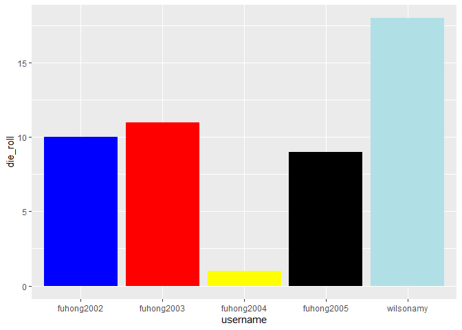
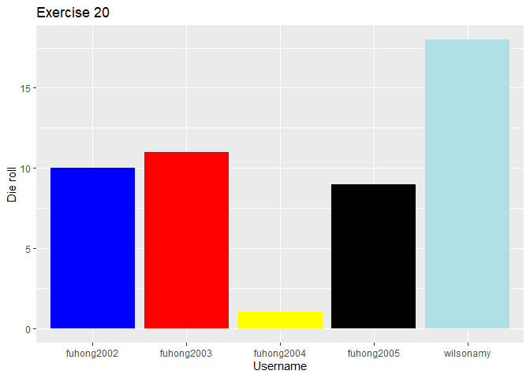
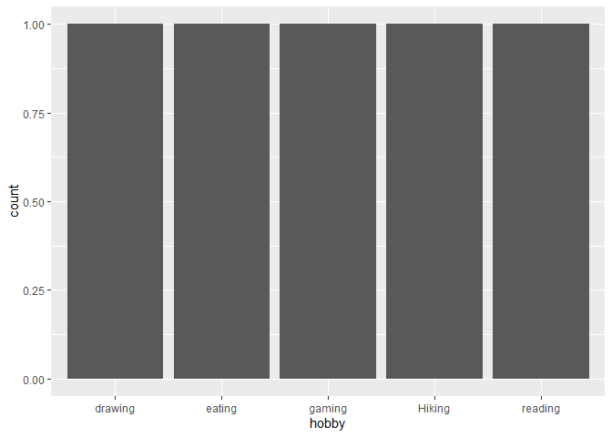

Lab 00 - Hello IDS!
================
INSERT TEAM NAME HERE
2022-09-23

### Load packages and data

``` r
library(tidyverse) 
```

### Exercises 13–17

We set up the data frame.

``` r
usernames <- c("wilsonamy", "fuhong2002", "fuhong2003", "fuhong2004", "fuhong2005") #Extend if necessary
nums <- c(18, 10, 11, 1, 9) #Extend if necessary
colours <- c("powderblue", "blue", "red", "yellow", "black") #Extend if necessary
hobbies <- c("Hiking", "reading", "gaming", "drawing", "eating") #Extend if necessary

team_data <- tibble(username = usernames, die_roll = nums, colour = colours,
                    hobby = hobbies)
```

### Exercise 18

We now work on visualising our data.

``` r
# Uncomment the three lines below
 p1 <- ggplot(team_data, aes(x = username, y = die_roll)) +
   geom_col(fill = team_data$colour)
 p1
```

<!-- -->

### Exercise 19

The graph shows the the number rolled by each team member in a bar chart
with each column being the colour they picked

### Exercises 20–21

``` r
# Uncomment the three lines below
 p1 +
   labs(x = "Username", y = "Die roll",
        title = "Exercise 20")
```

<!-- -->

This allowed me to change the axis names and include a title for the
graph

### Exercise 22

``` r
p2 <- ggplot(team_data, aes(x = hobby)) +
  geom_bar()
p2
```

<!-- -->

The amount of different hobbies would be too large to learn anything
meaningful so either they should be grouped in some sort of category or
the data should be displayed in another more visual way
